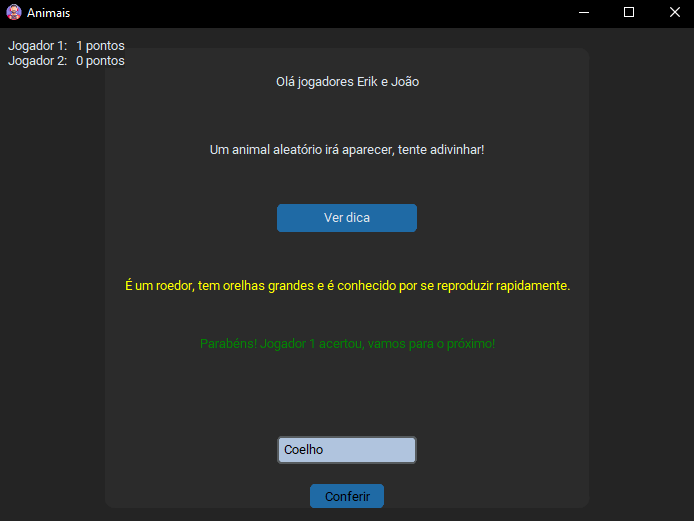

# Projeto de Interface Gráfica

Este projeto foi iniciado com o objetivo de entender loops e dicionários em Python, mas acabou se estendendo para incluir uma interface gráfica.

Uma breve descrição do meu projeto.

## Captura de Tela




## Tecnologias e Bibliotecas Usadas

- Python 3.11.9
- customtkinter
- random

## Funcionalidades

Este projeto permite aos usuários:

1. Inserir nomes (apenas caracteres).
2. Clicar em "Pronto" para iniciar o jogo.
3. Na nova tela, clicar em "Ver Dica" para obter uma dica.
4. Verificar qual é o jogador atual.
5. Clicar novamente em "Ver Dica".
6. Tentar adivinhar o animal com base nos seus conhecimentos.
7. Ao chegar a 10 pontos, o jogo termina.

## Tutorial de Uso

1. **Colocar nomes:** Digite os nomes dos jogadores, utilizando apenas caracteres.
2. **Clicar em "Pronto":** Depois de inserir os nomes, clique no botão "Pronto" para prosseguir.
3. **Ver Dica:** Na nova tela, clique em "Ver Dica" para receber uma dica sobre um animal.
4. **Verificar Jogador:** Veja qual é o jogador atual que deve adivinhar o animal.
5. **Clicar em "Ver Dica":** Clique novamente em "Ver Dica" para mais dicas.
6. **Adivinhar o Animal:** Baseado nas dicas fornecidas, tente adivinhar o animal.
7. **Finalizar Jogo:** O jogo termina automaticamente quando um jogador alcança 10 pontos.

## Requisitos

- Python 3.11.9
- Bibliotecas customtkinter e random

## Instalação

1. Clone este repositório:
   ```sh
   cd seu_repositorio

2. Navegue até o diretório do projeto:
   ```sh
   git clone https://github.com/seu_usuario/seu_repositorio.git

3. Instale as dependências:
   ```sh
   git clone https://github.com/seu_usuario/seu_repositorio.git

## Executando o Projeto

- Para executar o projeto, use o seguinte comando:
   ```sh
   python nome_do_arquivo.py

## Contribuição

- Sinta-se à vontade para contribuir com melhorias e novas funcionalidades. Para contribuir, siga os passos abaixo:

1. Fork este repositório.

2. Crie uma nova branch:
   ```sh
   git checkout -b feature/nova-funcionalidade

3. Faça as alterações necessárias e commit:
    ```sh
    git commit -m 'Adiciona nova funcionalidade'

4. Envie as alterações para o seu repositório fork:
    ```sh
    git push origin feature/nova-funcionalidade

5. Abra um Pull Request.


## Licença

Este projeto está licenciado sob a *Licença* MIT. Veja o arquivo LICENSE para mais detalhes.
